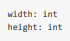
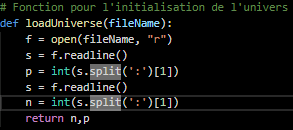
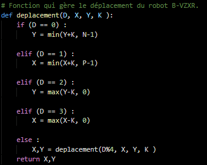
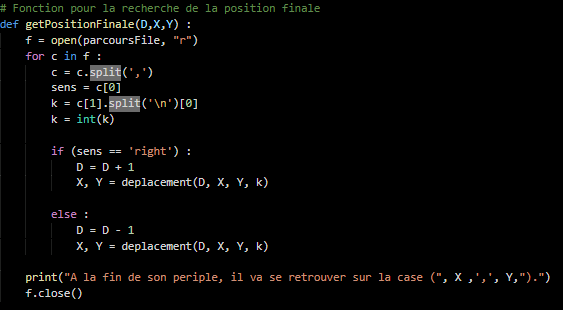
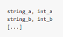
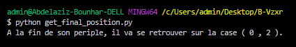
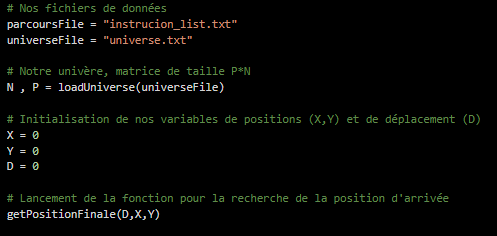
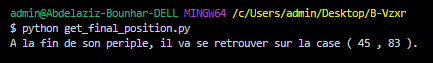

**Abdelaziz BOUNHAR                                                 C-Ways**

# Robot B-VZXR #

Le but de l'exercice est d’écrire un programme en **Python** qui crée un
**univers** dont les paramètres de dimensions sont définis dans un fichier
texte, ensuite le programme devra lire **une suite d'instructions** à partir
d’un autre fichier texte pour arriver déterminer la position finale du Robot
B-VZXR.

## 1. Initialisation de l’univers ##

L’univers est défini par le fichier universe.txt, ce dernier explique le
**Width** et le **Height** de notre univers et associe à chacune d’elle une
valeur entière.

Il faudra alors une fonction qui lie ce fichier et récupère les valeurs pour les
assigner à nos deux variables qui décrivent le Width et le Height de notre
univers. Cette fonction s’appelle *loadUniverse* et pend en paramètre le nom du
fichier depuis lequel les paramètre doivent être récupérées.

## 2. Langage du Robot B-VZXR ##

Le Robot B-VZXR comprend un seul langage qui lui permet de se déplacer et ce
selon un seul type d’instruction. Chaque instruction se constitue de deux
éléments, un premier indiquant le **sens du déplacement**, le second le **nombre
de pas d’avancement** du robot. Il exécute alors séquentiellement la suite
d’instruction qu’on lui donne en commençant toujours par la case du bas à gauche
de coordonnées (0,0).

## 3. Déplacement du Robot B-VZXR ##

Le Robots B-VZXR se déplace suivant le sens et le nombre k de cases qu’il a lu
depuis le fichier des instructions.

Pour résoudre ce problème tout en *optimisant la mémoire* et la *Complexité*,
j’ai essayé d’utiliser le minimum de variables, ainsi, au lieu d’utiliser une
matrice et faire déplacer à chaque fois les coordonnées (i,j) de la matrice,
j’ai modélisé le problème par une variable que j’ai nommé D qui indique la
direction (**haut**, **droite**, **bas**, **gauche**) à laquelle le robot fait
face à un instant t, à chaque déplacement, cette dernière change. **D est
initialisé par 0** car le robot naît toujours la tête vers le haut.

Selon la valeur de D le robot avancerait soit suivant l’axe des X ou celui des
Y.

Y

>   \-1 D = 0 +1

>   X D = 3 D = 1

D = 2

**D = 0** signifie que le robot est dirigé vers le **Haut**, dans le cas où il
aurait à se déplacer il va le faire selon la direction de l’axe des Y croissant.
J’ai choisi de prendre le minimum car si durant son déplacement le robot
rencontre un mur il s’arrête à la dernière case qui est de la valeur du **Height
-1**.

**D = 1** signifie que le robot est dirigé vers la **Droite** et dans ce cas son
déplacement se ferai selon l’axe des X croissant en prenant le minimum entre la
nouvelle valeur de X (X+k) et la valeur du **Width -1**.

**D = 2** signifie que le robot est dirigé vers le **Bas** et dans ce cas son
déplacement se ferai selon l’axe des Y décroissant en prenant cette fois le
maximum entre la nouvelle valeur de Y (Y-k) et **0**.

**D = 3** signifie que le robot est dirigé vers la **Gauche** et dans ce cas son
déplacement se ferai selon l’axe des X décroissant en prenant cette fois aussi
le maximum entre la nouvelle valeur de X (X-k) et **0**.

Si l’instruction dit au robot de se tourner à droite (‘right’), alors la valeur
de D est incrémentée de 1, dans le cas contraire (‘left’) D est décrémenté de 1.

**Remarque :** Si la valeur de D dépasse 3 ou devient négatif, un *scale* est
appliqué en faisant un appel récursif de la fonction *deplacement* sur la valeur
de D modulo 4 (D%4) de façon a rester toujours dans l’intervalle des entier
**[\|0,3­­\|]**.

En effet, si D devient -1 alors -1%4 = 3, et si D devient 4 alors 4%4 = 0. On
revient toujours à notre intervalle des entier **[\|0,3­­\|]**.

La fonction *getPositionFinale* intervient pour permettre au Robot B- VZXR de
comprendre les instructions qui lui sont transmises et donc de se déplacer dans
son univers.

Le fichier d’instructions est une suite structurée de la manière suivante :

Chaque ligne contient deux éléments séparés par une virgule, le premier élément
indique le sens de déplacement, notre variable D dépend alors de ce dernier. Le
second est le nombre k indiquant le nombre de cases que le robot devrait
traverser pour chaque instruction.

La fonction *getPositionFinale* ouvre le fichier d’instructions en mode lecture,
et *pour chaque ligne lue* fait le traitement suivant; elle fait un split par la
virgule de sorte à séparer les deux éléments constituant l’instructions, elle
charge le premier élément dans une variable **sens**, pour le second élément
elle fait un split par ‘\\n’ qui est un caractère invisible mais présent
indiquant la fin de ligne, puis elle prend la valeur entière de ce second
élément et la charge dans la variable de déplacement **k**. Selon le sens, elle
fait un traitement spécifique, si le sens est ‘**right**’, elle incrémente tout
d’abord la valeur de la variable D de 1 pour faire une simulation d’un quart de
tour à droite du robot puis fait change les valeurs des variables X et Y en
faisant appel à la fonction *deplacement* qui prend en paramètre les valeurs
actuelles de X, Y, D et k en retourne les nouvelles valeurs de X et Y. Par
ailleurs, si le sens est ‘**left**’, elle décrémente tout d’abord la valeur de
la variable D de 1 (un quart de tour à gauche) puis fait appel à la fonction
*deplacement* qui se chargera de changer les valeurs de X et Y dépendamment des
valeurs actuelles de X, Y, D et k.

## Exemple illustratif ##

Considérons la suite des instructions suivante pour un univers de taille 6\*4 :

-   right, 3

-   left, 2

-   left, 10

Ainsi, par exemple pour son premier déplacement, initialement la valeur de D
étant égale à zéro (regard vers le haut) elle devient égale à **1** car le sens
est ‘right’, le robot devrait avancer de 3 cases selon l’axe des X croissant et
devrait être donc à la position (3,0). La deuxième instruction indique qu’il
faut se déplacer de 2 cases à gauche, la valeur de D est donc décrémentée de 1
est devient égale à **0**, puis le robot fait un déplacement de deux cases vers
le haut et sa position devient (3,2). La dernière instruction indique au robot
qu’il faut prendre un sens ‘left’ et se déplacer de 10 cases, la valeur de D
devient égale à -1, la fonction *deplacement* reçoit les valeurs actuelles de D,
X, Y et k, or D étant égale à -1 elle fait un appel récursif sur
*deplacement(-1%4 , 3, 2 , 10)*, ce qui revient à un appel sur *deplacement(3,
3, 2 , 10)*, D devient donc égale à 3, le robot devrait donc faire un
déplacement de 10 cases sur l’axe de X décroissant, cependant la valeur de X-k =
2-10 = -8 est supérieur strictement à la largeur de l’univers qui est 6, ainsi
la valeur de X serait égale au max(-8, 0) qui est 0, ainsi **le robot finirait
sur la case (0,2)**.

C’est bien ce que renvoie la fonction pour cet exemple.

## Programme principale ##

On charge les valeurs **N** et **P** des dimensions de notre univers, puis on
initialise la position du robot par (0,0) et sa direction initiale vers le haut
(D=0), et puis on fait appel à la fonction *getPositionFinale* qui prend en
paramètre les variables **D**, **X** et **Y** et nous donne en retour la position finale du
robot.

En utilisant le fichier d’instructions ‘instrucion_list.txt’ le résultat est :

